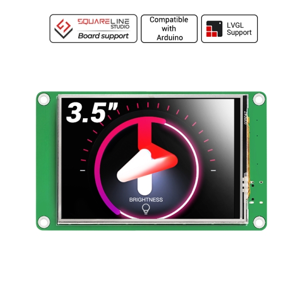
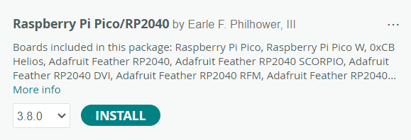
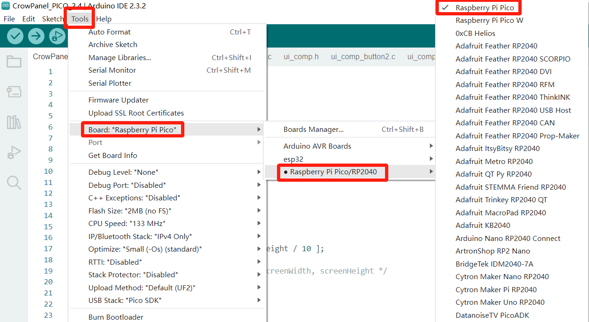
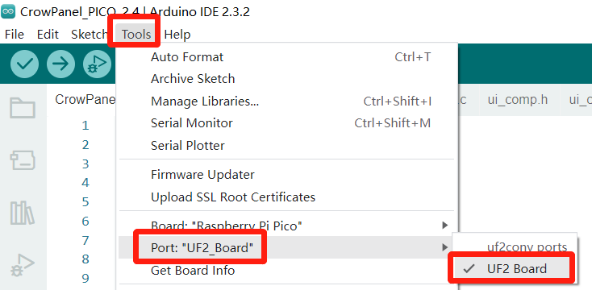

### 1, Product picture

### 2, Product version number

|      | Hardware | Software | Remark |
| ---- | -------- | -------- | ------ |
| 1    | V1.0     | V1.0     | latest |

### 3, product information

- Main Chip: RP2040
- Processor: Dual-core 32-bit ARM Cortex-M0+ @ 133MHz
- Memory: 264kB on-chip SRAM (supports up to 16MB of off-chip flash memory)
- Screen Size: 3.5 inch
- Resolution: 480*320
- Signal Interface: SPI
- Touch Type: Resistive Touch
- Panel Type: TFT LCD
- Power Input: 5V-2A
- Active Area: 53.64*71.52mm(W * H)
- Dimensions: 62.5 * 104.5 * 13.5mm(W * H * D)

### 4, Use the driver module

| Name | dependency library |
| ---- | ------------------ |
| LVGL | lvgl/lvgl@8.3.3    |

### 5,Quick Start

##### Arduino IDE starts

1.Download the library files used by this product to the 'libraries' folder.

C:\Users\Documents\Arduino\libraries\

2.Open the Arduino IDE

3.Open the code configuration environment and burn it

### 6,Folder structure.

|--Dimensional Drawing: Contains the dimensional drawing file (.dwg) of the hardware.

|--Datasheet: Includes datasheets for components used in the project, providing detailed specifications, electrical characteristics, and pin configurations.

|--Eagle_SCH&PCB: Contains **Eagle CAD** schematic (`.sch`) and PCB layout (`.brd`) files. These are used for circuit design and PCB manufacturing.

|--example: Provides example code and projects to demonstrate how to use the hardware and libraries. These examples help users get started quickly.

|--factory_firmware: Stores pre-compiled factory firmware that can be directly flashed onto the device. This ensures the device runs the default functionality.

|--factory_sourcecode: Contains the source code for the factory firmware, allowing users to modify and rebuild the firmware as needed.

### 7,Pin definition

#define I2C0_SDA 20

#define I2C0_SCL 21

#SD

const int _MISO = 12;  // AKA SPI RX

const int _MOSI = 11;  // AKA SPI TX

const int _CS = 22;

const int _SCK = 10;